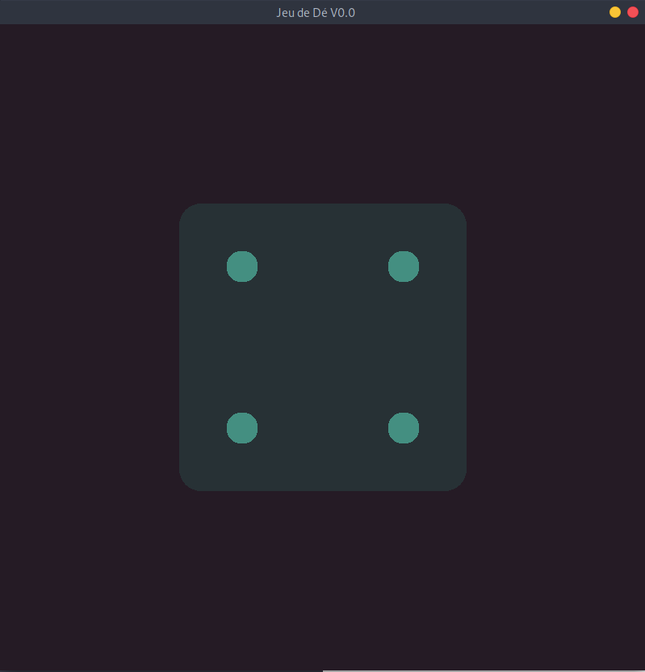

<p align="center"></p>
# Projet Jeu de Dé avec SDL2

Ce projet est une introduction à la librairie SDL2 en langage C. Il s'agit de développer un jeu de dé avec une interface graphique simple. Le projet met l'accent sur l'affichage de fenêtres, l'affichage d'images, la création d'animations, et la gestion d'événements.

## Fonctionnalités

- **Affichage de fenêtres** : Création et gestion d'une fenêtre graphique avec SDL2.
- **Affichage d'images** : Chargement et affichage d'images pour illustrer les faces du dé.
- **Animation** : Animation de la rotation du dé avant de révéler le résultat.
- **Gestion des événements** : Gestion des interactions utilisateur (clics, touches du clavier) pour lancer le dé et quitter le programme.
- **Génération aléatoire** : Utilisation d'un générateur de nombres aléatoires pour déterminer le résultat du dé.

## Prérequis

Avant de compiler et d'exécuter ce projet, assurez-vous d'avoir installé les éléments suivants :

- [SDL2](https://www.libsdl.org/download-2.0.php)
- Un compilateur C (comme `gcc`)

### Installation de SDL2 sous Linux
```bash
sudo apt-get install libsdl2-dev
```
  
#### Compilation

```bash
make
```
```bash
./ludo
```
